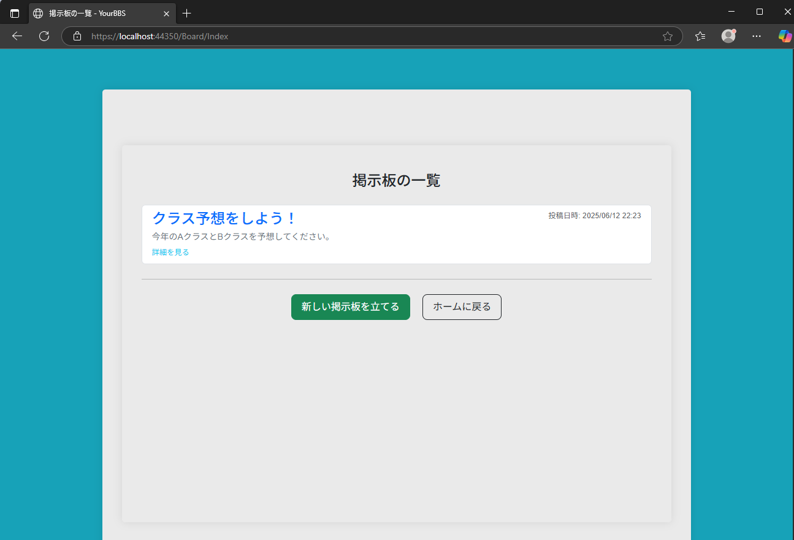
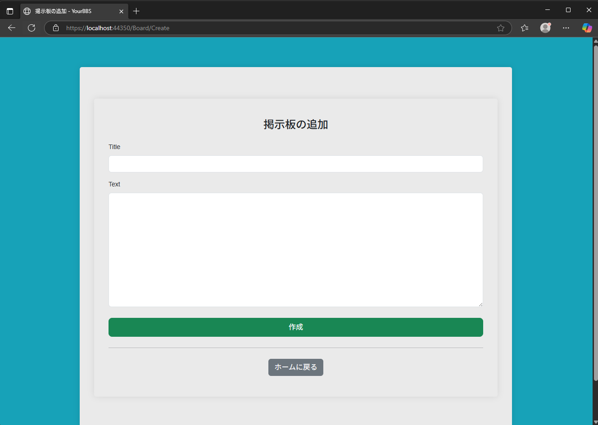
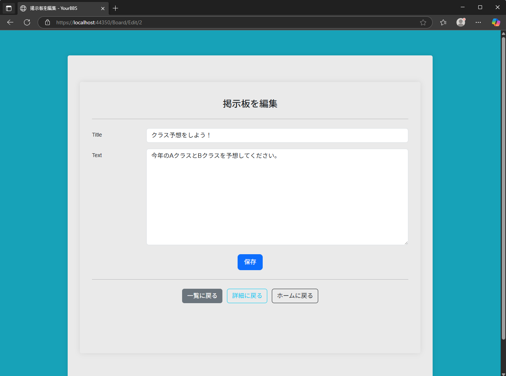

## 1.概要
簡易的な掲示板アプリを作り、Webアプリケーションに触れる

## 2.開発の背景・目的
#### 目的
Webアプリ開発の基礎、ASP.NETの概要を理解するため
#### テーマ選択理由
CRUDを意識するため、適した機能追加が可能な掲示板アプリを選択

（掲示板の作成、内容の取得と表示、内容の変更、内容の削除）

## 3.機能概要

1)　ログイン　　：IDとパスワードを指定してログインを行う

2)　ユーザー登録：ログインするためのユーザー新規追加

3)　トップページ：掲示板の件数と最新の投稿を参照

4)　掲示板一覧　：掲示板の一覧を参照

5)　掲示板　　　：掲示板の内容参照と返信機能

6)　掲示板追加　：新規掲示板の作成

7)　掲示板編集　：掲示板の内容を編集

8） 掲示板削除　：掲示板削除

 
## 4.工夫点
一般的な掲示板の機能を考慮し、トップページで掲示板の件数を表示、最新の投稿を参照可能にした。
例外処理を意識した造りにした。

## 5.技術スタック
ASP.NET / C# / ローカルデータベース

## 6.今後の予定 
   ログイン画面を作成し、ユーザー管理ができるようになったものの、権限付与や画面制限が行われていない。
　 削除や編集などに対して権限確認を行うようにする。
   

## 7.主要画面のキャプチャ

#### ログイン

#### アカウント登録
![アカウント登録(images/CreateAccount.png "ログイン用のアカウントを登録するページです。")

#### トップページ

#### 掲示板一覧

#### 掲示板作成

#### 掲示板参照

#### 掲示板編集

#### 掲示板削除

